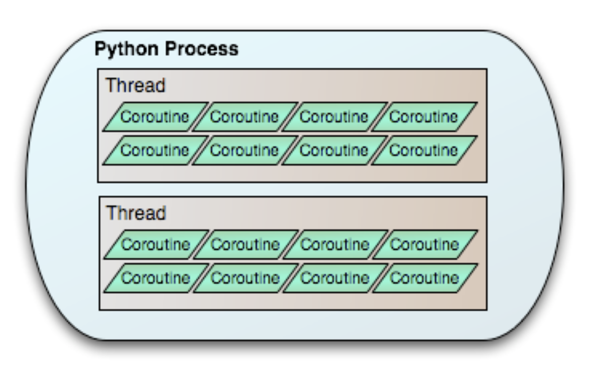

# Concurrent-and-Parallel-Programming

- Repository for self-learning 'Concurrent and Parallel Programming'. 
- It is recommended to learn the related concepts in operating system before diving into concurrent and parallel programming.

## Topics
1. Process, Thread, and Coroutine

 
*Process, Thread, and Coroutine in Python* [[src](https://eventlet.readthedocs.io/en/v0.35.0/threading.html)]

### Learning Resources
- [ ] [Lecture Notes: 'Operating System' from University of Wisconsin-Madison](https://pages.cs.wisc.edu/~bart/537/lecturenotes/titlepage.html)
- [ ] [Lecture Notes: 'Concurrent and Parallel Programming' from University of Waterloo](https://student.cs.uwaterloo.ca/~cs343/F24/)

### Useful Blogs
- [Python guide: Using multiprocessing versus multithreading](https://medium.com/capital-one-tech/python-guide-using-multiprocessing-versus-multithreading-55c4ea1788cd)