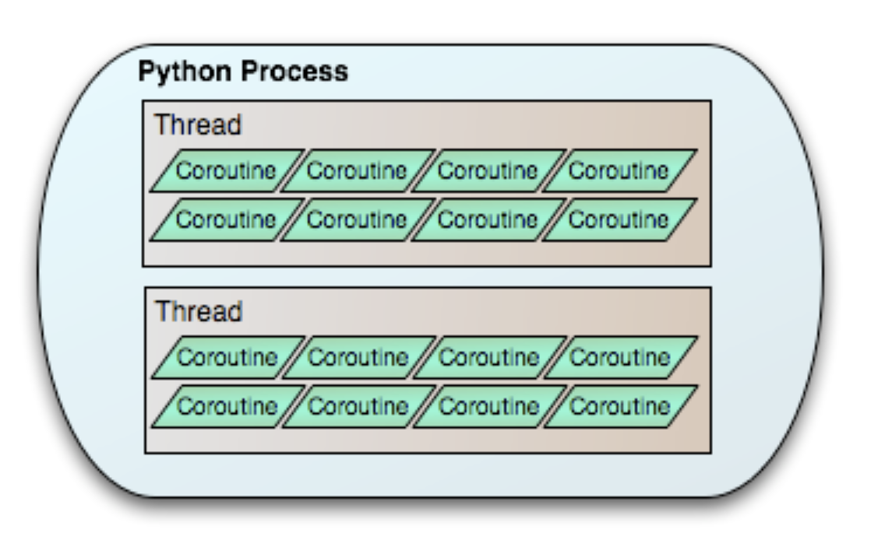
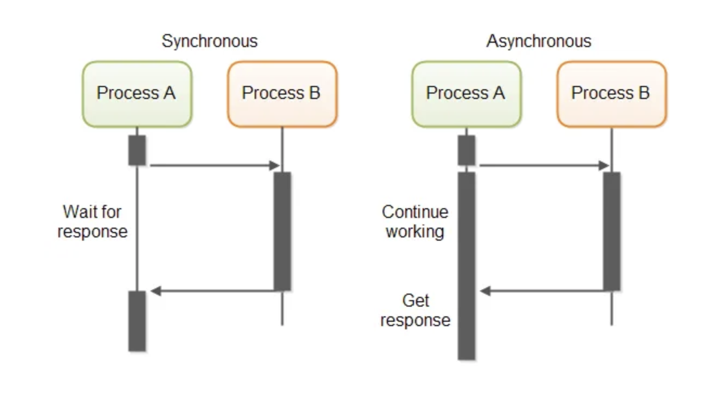

# Concurrent-and-Parallel-Programming

### Process, Thread, and Coroutine
 
*Process, Thread, and Coroutine in Python* [[REF](https://eventlet.readthedocs.io/en/v0.35.0/threading.html)]

### Synchronous and Asynchronous

*Synchronous and Asynchronous* [[REF](https://medium.com/from-the-scratch/wtf-is-synchronous-and-asynchronous-1a75afd039df)]

### Real-world Analogy
Let's understand these programming paradigms through a restaurant kitchen analogy:

1. **Multithreading**
   - Like having multiple chefs (threads) working simultaneously
   - Each chef handles different dishes independently
   - Great for parallel tasks
   - Requires coordination (like sharing kitchen equipment)
   - Examples:
     * Chef 1: Preparing main course
     * Chef 2: Making dessert
     * Chef 3: Handling appetizers

2. **Asynchronous Programming**
   - Like one skilled chef efficiently managing multiple dishes
   - Switches between tasks based on what needs attention
   - No time is wasted waiting
   - Workflow Example:
     * Put rice in rice cooker
     * While rice cooks: chop vegetables
     * While vegetables roast: marinate meat
     * While meat marinates: make sauce
     * Switch back to check rice ...
   
3. **Multiprocessing**
   - Like having multiple separate kitchen stations
   - Each station has its own equipment and chef
   - Minimal coordination needed between stations
   - Best for CPU-intensive tasks
   - Example: Separate kitchens for hot dishes, cold dishes, and bakery

### Learning Resources
- [ ] [Lecture Notes: 'Operating System' from University of Wisconsin-Madison](https://pages.cs.wisc.edu/~bart/537/lecturenotes/titlepage.html)
- [ ] [Lecture Notes: 'Concurrent and Parallel Programming' from University of Waterloo](https://student.cs.uwaterloo.ca/~cs343/F24/)

### Useful Blogs
- [Python guide: Using multiprocessing versus multithreading](https://medium.com/capital-one-tech/python-guide-using-multiprocessing-versus-multithreading-55c4ea1788cd)
- [An Introduction to Asynchronous Programming in Python ](https://medium.com/velotio-perspectives/an-introduction-to-asynchronous-programming-in-python-af0189a88bbb) (Highly Recommended)